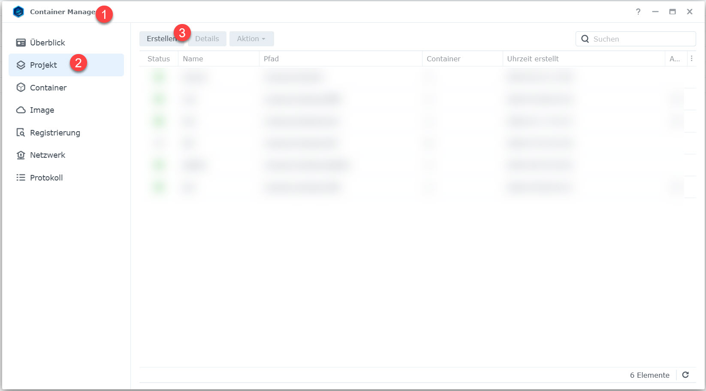

# radicale_on_synology_docker
Install and run radicale in Synology using a Docker container.

## What is radicicale?
Radicale is a very lightweight but powerful CalDAV (calendars, to-do lists) and CardDAV (contacts) server you can host yourself.

Here's the official homepage: <a href="https://radicale.org/" title="radicale.org" target="_blank" rel="nofollow">https://radicale.org</a>

## Purpose of this Github repository
* define the prereqisites
* setting up your environment in your Synology
* explain how to build your own docker container
* explain how to use the docker container
* run radicale

## Prerequisites

* A Synology NAS of the <a href="https://www.synology.com/en-us/products?product_line=ds_plus" title="Synology Plus Series" target="_blank" rel="nofollow">Plus Series</a>, as those are enabled for virtualizing environments with their more powerful central processing units (CPUs). These are easily identified by the name DSxxxx+.
* Some understanding of DNS, Network, Ports and Proxies to make sense of and secure things.
* Understanding of IP handling and Port forwarding for your Router.
* Understanding of the Synology Disk Station (DS) and the Disk Station Manager (DSM).
* Having Administrator Account access for DSM.
* A registered Domain which forwards (e.g. via DynDNS) to your Router/Server (Synology DS) and/or a Subdomain with according CNAME entry.
* On your Synology Docker is installed and running.
* SSH can be enabled and you know how to operate on command line with rrot access.

## Setting up the development area

To start, one needs a development area on the Synology. It is used to keep all needed files together that are needed to ramp up a Docker Image and in further steps the container and its necessary configuration files. This step is needed, regardless if you want to build your own image or if you simply publish the container.

* Use Synology’s desktop: **Control Panel-> Shared Folder-> Create** 
* For later examples I called mine **dock_dev**. 
* In dock_dev you create a folder called **radicale**. 
* So the full path should sound **/volume1/dock_dev/radicale** 
* copy the files provided by this repository to the new development folder on your Synology.
* Make sure you are able to SSH into your Synology. I will not explain how to do that. If you need help, ask Google.

The next step depends on what you want to achieve. If you simply want to use the given DockerHub Image and deploy your container skip the next steps and move to [Deploy the Docker Container](#deploy-the-docker-container-in-your-synology)

## Building the Docker image

This section covers how to develop your own radicale image an push it to DockerHub. If you aren’t going to develop an own container [>jump this section<](#deploy-the-docker-container-in-your-synology)!
* SSH into Synology
* sudo -i
* cd to your development area in your Synology.
Based on previous steps, you should find a file named **Dockerfile**. 
In this example:
    * cd /volume1/dock_dev/radicale
    
* To build the image run command: **docker build -t 4tegs/radicale .**  
Don't forget the "." at the end of the line!
* You should name your container based on your DockerHub ID ( 4tegs) and project name (radicale). If you don’t do so, you need to „re“tag you image later for the DockerHub push.
Have a look at Synology -> Docker, you should find the image there.

### Push image to DockerHub
* Command: **docker login** (provide your accounts credentials)
* **docker push 4tegs/radicale:latest**

## Deploy the Docker Container in your Synology
To deploy a Radical WebDav/CalDav Service throug a Docker container on Synology follow the next steps. The listed [prereqisites](#prereqisites) must be fullfilled.

### The Data Area Folder
When Docker was installed, Synology has set up a shared folder /volume1/docker. This folder can be used to host your containers configuration files and production data.

Let’s set up the radicale folder space for our container.

* SSH into Synology
* sudo -i
* command: **mkdir /volume1/docker/radicale**

### Install configuration files
From this repository movere the follow 4 files to **/volume1/docker/radicale**:
* config
* logging
* rights
* users

### Provide User and Password to use Radicale
Radicale needs to be clear on access rights. The config file is set up in a way, that access is provided a htpasswd type of user / password management and cyphered with an MD5 algorithm (very strong). If you want to change that, consult the radicale help sites.

To add your user and password:

* cd /volume1/docker/radicale
* **htpasswd -cmb users your-user1 password1**  
if you want to add another user: 
**htpasswd -mb users your-user2 password2**

### Deploy container by creating a project
DSM 7 provides a good way to create the container by creating a project. This way the maintenance of the container gets pretty smart. 

First use the **docker-compose.yml** provided and copy it to your docker folder, in our example **/volume1/docker/radical**

Now start the container manager and select **project**.

Provide a project name, select the folder for your container. 

Use existing docker-compose.yml

See settings of your docker-compose.yml. 

Set some basics for Synology Web Station later.

The container is created.

Finally you need to setup your WebPortal within Synology Web Station. 
Here is an example for setting up a DYNDNS way. You should have set up the DYNDNS for your radicale server already. 

Port forwarding works a little different. See the Synology documentation.

Now you can call radicale either by your external address or by http://your-internal-ip:5232 (e.g. http://192.168.58.70:5232/)